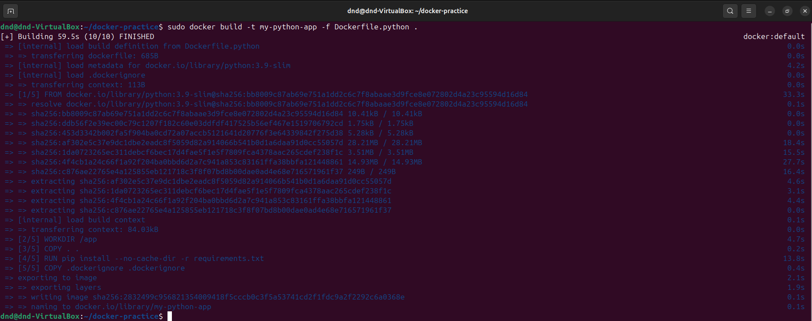

# Домашнее задание к занятию "`Практическое применение Docker`" - `Дедюрин Денис`

---
## Задание 1.
1. Сделайте в своем github пространстве fork [репозитория](https://github.com/netology-code/shvirtd-example-python/blob/main/README.md).
   Примечание: В связи с доработкой кода python приложения. Если вы уверены что задание выполнено вами верно, а код python приложения работает с ошибкой то используйте вместо main.py файл not_tested_main.py(просто измените CMD)
3. Создайте файл с именем ```Dockerfile.python``` для сборки данного проекта(для 3 задания изучите https://docs.docker.com/compose/compose-file/build/ ). Используйте базовый образ ```python:3.9-slim```. 
Обязательно используйте конструкцию ```COPY . .``` в Dockerfile. Не забудьте исключить ненужные в имадже файлы с помощью dockerignore. Протестируйте корректность сборки.  
4. (Необязательная часть, *) Изучите инструкцию в проекте и запустите web-приложение без использования docker в venv. (Mysql БД можно запустить в docker run).
5. (Необязательная часть, *) По образцу предоставленного python кода внесите в него исправление для управления названием используемой таблицы через ENV переменную.

### Ответ: 

Создаем файлы **Dockerfile.python** и **.dockerignore** со следующим содержимым:

**Dockerfile.python**

```
# Используем базовый образ python:3.9-slim
FROM python:3.9-slim

# Устанавливаем рабочую директорию
WORKDIR /app

# Копируем все файлы проекта в контейнер
COPY . .

# Устанавливаем зависимости из requirements.txt
RUN pip install --no-cache-dir -r requirements.txt

# Исключаем ненужные файлы с помощью dockerignore
COPY .dockerignore .dockerignore

# Указываем команду для запуска приложения (по умолчанию main.py)
CMD ["python", "main.py"]
```

**.dockerignore**

```
*.pdf
*.md
LICENSE
haproxy/
nginx/
__pycache__/
*.pyc
.DS_Store
.env
```

Пробуем выполнить команду для сборки образа:

```
docker build -t python-app -f Dockerfile.python .
```



Чтобы приложению успешно запустилось и ему было куда подключаться, добавим еще один контейнер с БД MySQL:

```
docker run -d --name mysql-db \
    -e MYSQL_ROOT_PASSWORD=YtReWq4321 \
    -e MYSQL_DATABASE=virtd \
    -e MYSQL_USER=app \
    -e MYSQL_PASSWORD=QwErTy1234 \
    -p 3306:3306 \
    mysql:5.7
```

Пробуем запустить наш собранный контейнер с приложением командой:

```
docker run --rm -p 5000:5000 --name my-app \
    --env DB_HOST=mysql-db \
    --env DB_USER=app \
    --env DB_PASSWORD=QwErTy1234 \
    --env DB_NAME=virtd \
    my-python-app
```


# shvirtd-example-python

Example Flask-application for docker compose training.
## Installation
First, you need to clone this repository:

```bash
git clone https://github.com/netology-code/shvirtd-example-python.git
```

Now, we will need to create a virtual environment and install all the dependencies:

```bash
python3 -m venv venv  # on Windows, use "python -m venv venv" instead
. venv/bin/activate   # on Windows, use "venv\Scripts\activate" instead
pip install -r requirements.txt
python main.py
```
You need to run Mysql database and provide following ENV-variables for connection:  
- DB_HOST (default: '127.0.0.1')
- DB_USER (default: 'app')
- DB_PASSWORD (default: 'very_strong')
- DB_NAME (default: 'example')

The applications will always running on http://localhost:5000.  
To exit venv just type ```deactivate```

## License

This project is licensed under the MIT License (see the `LICENSE` file for details).
