# Домашнее задание к занятию "`Практическое применение Docker`" - `Дедюрин Денис`

---
## Задание 1.
1. Сделайте в своем github пространстве fork [репозитория](https://github.com/netology-code/shvirtd-example-python/blob/main/README.md).
   Примечание: В связи с доработкой кода python приложения. Если вы уверены что задание выполнено вами верно, а код python приложения работает с ошибкой то используйте вместо main.py файл not_tested_main.py(просто измените CMD)
3. Создайте файл с именем ```Dockerfile.python``` для сборки данного проекта(для 3 задания изучите https://docs.docker.com/compose/compose-file/build/ ). Используйте базовый образ ```python:3.9-slim```. 
Обязательно используйте конструкцию ```COPY . .``` в Dockerfile. Не забудьте исключить ненужные в имадже файлы с помощью dockerignore. Протестируйте корректность сборки.  
4. (Необязательная часть, *) Изучите инструкцию в проекте и запустите web-приложение без использования docker в venv. (Mysql БД можно запустить в docker run).
5. (Необязательная часть, *) По образцу предоставленного python кода внесите в него исправление для управления названием используемой таблицы через ENV переменную.

### Ответ: 

Создаем файлы **Dockerfile.python** и **.dockerignore** со следующим содержимым:

**Dockerfile.python**

```
# Используем базовый образ python:3.9-slim
FROM python:3.9-slim

# Устанавливаем рабочую директорию
WORKDIR /app

# Копируем все файлы проекта в контейнер
COPY . .

# Устанавливаем зависимости из requirements.txt
RUN pip install --no-cache-dir -r requirements.txt

# Исключаем ненужные файлы с помощью dockerignore
COPY .dockerignore .dockerignore

# Указываем команду для запуска приложения (по умолчанию main.py)
CMD ["python", "main.py"]
```

**.dockerignore**

```
*.pdf
*.md
LICENSE
haproxy/
nginx/
__pycache__/
*.pyc
.DS_Store
.env
```

Пробуем выполнить сборку образа командой:

```
docker build -t python-app -f Dockerfile.python .
```


Чтобы приложению успешно запустилось и ему было куда подключаться, добавим еще один контейнер с БД MySQL:

```
docker run -d --name mysql-db \
    -e MYSQL_ROOT_PASSWORD=YtReWq4321 \
    -e MYSQL_DATABASE=virtd \
    -e MYSQL_USER=app \
    -e MYSQL_PASSWORD=QwErTy1234 \
    -p 3306:3306 \
    mysql:5.7
```
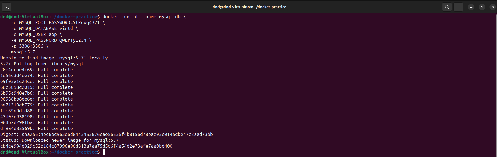

Пробуем запустить наш собранный контейнер с приложением командой:

```
docker run -d --rm -p 5000:5000 --name my-app \
    --env DB_HOST=192.168.1.119 \
    --env DB_USER=app \
    --env DB_PASSWORD=QwErTy1234 \
    --env DB_NAME=virtd \
    my-python-app
```

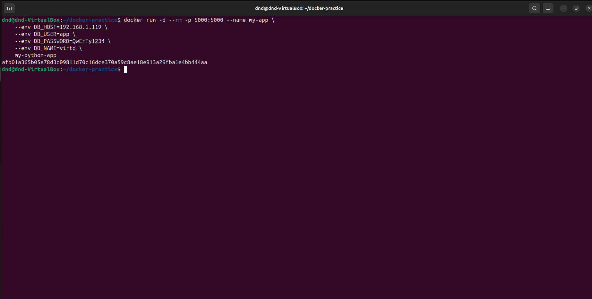

Проверяем что оба браза корректно запустились и после этого зайдем внутрь образа с приложениеи и проверим, что в него не попавли лишние файлы и директории описанные в **.dockerignore**:

```
docker ps
```
```
docker exec -it afb01a365b05 bash
```
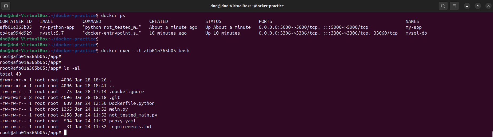

Видим что ничего лишнего в docker-контейнере нет.

---
## Задание 3.

1. Изучите файл "proxy.yaml"
2. Создайте в репозитории с проектом файл ```compose.yaml```. С помощью директивы "include" подключите к нему файл "proxy.yaml".
3. Опишите в файле ```compose.yaml``` следующие сервисы: 

- ```web```. Образ приложения должен ИЛИ собираться при запуске compose из файла ```Dockerfile.python``` ИЛИ скачиваться из yandex cloud container registry(из задание №2 со *). Контейнер должен работать в bridge-сети с названием ```backend``` и иметь фиксированный ipv4-адрес ```172.20.0.5```. Сервис должен всегда перезапускаться в случае ошибок.
Передайте необходимые ENV-переменные для подключения к Mysql базе данных по сетевому имени сервиса ```web``` 

- ```db```. image=mysql:8. Контейнер должен работать в bridge-сети с названием ```backend``` и иметь фиксированный ipv4-адрес ```172.20.0.10```. Явно перезапуск сервиса в случае ошибок. Передайте необходимые ENV-переменные для создания: пароля root пользователя, создания базы данных, пользователя и пароля для web-приложения.Обязательно используйте уже существующий .env file для назначения секретных ENV-переменных!

2. Запустите проект локально с помощью docker compose , добейтесь его стабильной работы: команда ```curl -L http://127.0.0.1:8090``` должна возвращать в качестве ответа время и локальный IP-адрес. Если сервисы не стартуют воспользуйтесь командами: ```docker ps -a ``` и ```docker logs <container_name>``` . Если вместо IP-адреса вы получаете ```NULL``` --убедитесь, что вы шлете запрос на порт ```8090```, а не 5000.

5. Подключитесь к БД mysql с помощью команды ```docker exec -ti <имя_контейнера> mysql -uroot -p<пароль root-пользователя>```(обратите внимание что между ключем -u и логином root нет пробела. это важно!!! тоже самое с паролем) . Введите последовательно команды (не забываем в конце символ ; ): ```show databases; use <имя вашей базы данных(по-умолчанию example)>; show tables; SELECT * from requests LIMIT 10;```.

6. Остановите проект. В качестве ответа приложите скриншот sql-запроса.

### Ответ: 

Изменяем файл **Dockerfile.python** и добавляем новый **compose.yaml** со следующим содержимым:

**Dockerfile.python**

```
# Стадия 1: Установка зависимостей
FROM python:3.9-slim AS builder

# Устанавливаем необходимые зависимости для сборки
WORKDIR /app
COPY requirements.txt .

# Устанавливаем зависимости из requirements.txt
RUN pip install --no-cache-dir -r requirements.txt

# Стадия 2: Финальная сборка образа
FROM python:3.9-slim

# Копируем только необходимые файлы из стадии builder
WORKDIR /app
COPY --from=builder /app /app

# Копируем установленные библиотеки из builder (зависимости pip)
COPY --from=builder /usr/local/lib/python3.9/site-packages /usr/local/lib/python3.9/site-packages

# Копируем основной код приложения
COPY . .

# Открываем порт для приложения
EXPOSE 8090

# Команда для старта приложения
CMD ["python", "main.py"]
```

**compose.yaml**

```
services:
  db:
    image: mysql:8
    container_name: db
    networks:
      backend:
        ipv4_address: 172.20.0.10
    environment:
      MYSQL_ROOT_PASSWORD: ${MYSQL_ROOT_PASSWORD}
      MYSQL_DATABASE: ${MYSQL_DATABASE}
      MYSQL_USER: ${MYSQL_USER}
      MYSQL_PASSWORD: ${MYSQL_PASSWORD}
    restart: always
    volumes:
      - mysql_data:/var/lib/mysql

  web:
    build:
      context: .
      dockerfile: Dockerfile.python  # Указываем, что приложение собирается из Dockerfile.python
    container_name: web
    networks:
      backend:
        ipv4_address: 172.20.0.5
    environment:
      DB_HOST: db
      DB_USER: ${MYSQL_USER}
      DB_PASSWORD: ${MYSQL_PASSWORD}
      DB_NAME: ${MYSQL_DATABASE}
    restart: always
    depends_on:
      - db

# Подключаем файл proxy.yaml
include:
  - proxy.yaml

networks:
  backend:
    driver: bridge
    ipam:
      config:
        - subnet: "172.20.0.0/24"

volumes:
  mysql_data:
    driver: local
```

Запускаем проект командой:

```
docker compose up -d
```
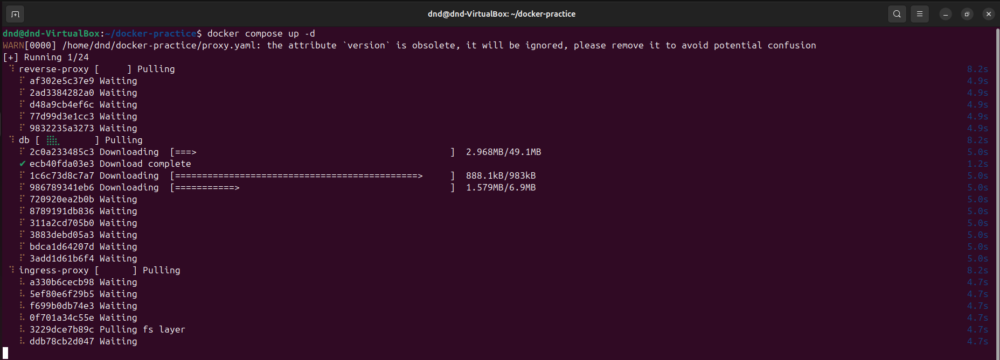

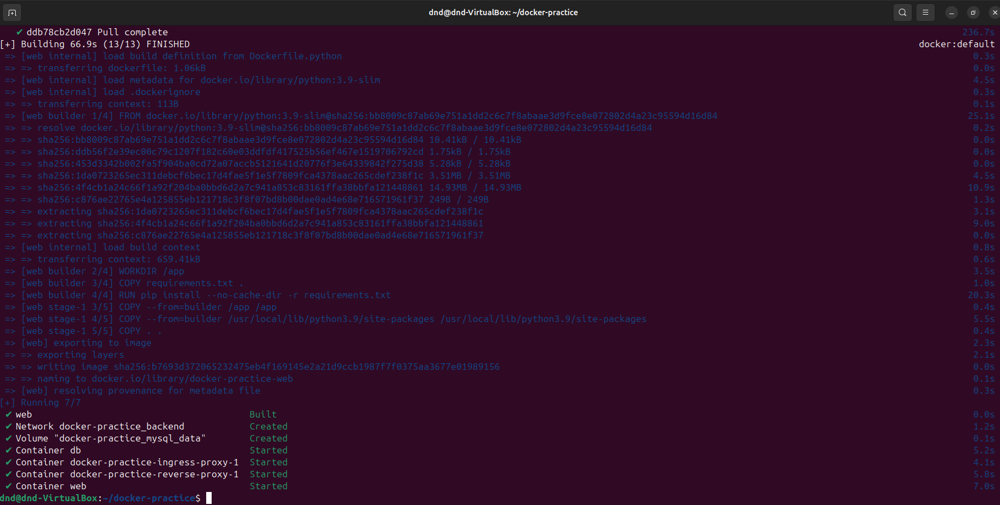

Выполняем команду:

```
curl -L http://127.0.0.1:8090
```
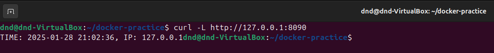

Далее подключаемся к контейнеру с БД и выполняем запросы из задания:

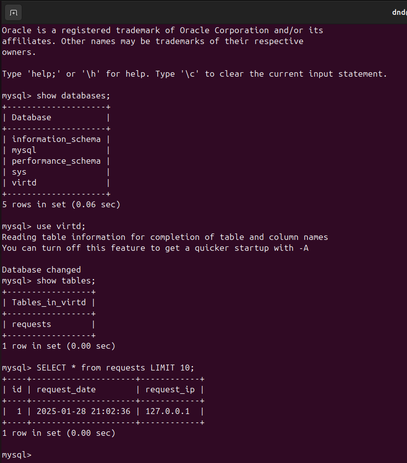

---
## Задача 4
1. Запустите в **Yandex Cloud** ВМ (вам хватит 2 Гб Ram).
2. Подключитесь к Вм по ssh и установите docker.
3. Напишите bash-скрипт, который скачает ваш fork-репозиторий в каталог /opt и запустит проект целиком.
4. Зайдите на сайт проверки http подключений, например(или аналогичный): ```https://check-host.net/check-http``` и запустите проверку вашего сервиса ```http://<внешний_IP-адрес_вашей_ВМ>:8090```. Таким образом трафик будет направлен в ingress-proxy. ПРИМЕЧАНИЕ:  приложение main.py( в отличие от not_tested_main.py) весьма вероятно упадет под нагрузкой, но успеет обработать часть запросов - этого достаточно. Обновленная версия (main.py) не прошла достаточного тестирования временем, но должна справиться с нагрузкой.
5. (Необязательная часть) Дополнительно настройте remote ssh context к вашему серверу. Отобразите список контекстов и результат удаленного выполнения ```docker ps -a```
6. В качестве ответа повторите  sql-запрос и приложите скриншот с данного сервера, bash-скрипт и ссылку на fork-репозиторий.

### Ответ: 

Создаем и запускем в Yandex Cloud ВМ:

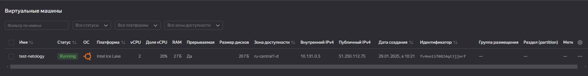

Подключаемся по ssh, выполняем обновление системы и установку docker:

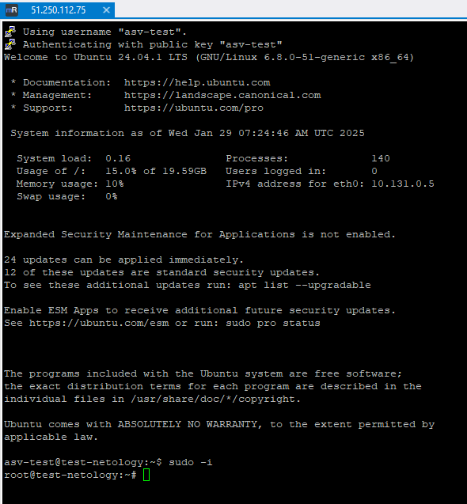

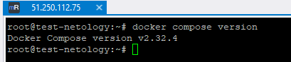

Создаем bash-скрипт **docker-fork.sh** со следующим содержимым:

```
#!/bin/bash

# Перейти в каталог /opt
cd /opt

# Склонировать репозиторий 
git clone https://github.com/omegavlg/docker-practice

# Перейти в каталог проекта
cd docker-practice

# Собрать и запустить Docker контейнеры
docker compose up -d

# Проверить статус контейнеров
docker ps -a
```
Даем скрипту права на запуск:

```
chmod +x docker-fork.sh
```
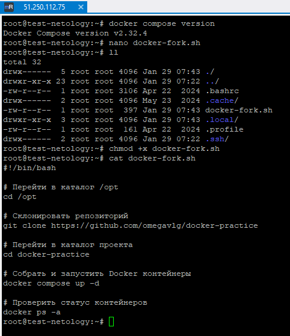

Запускаем скрипт:

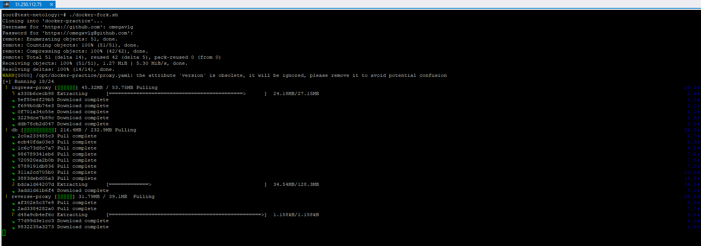

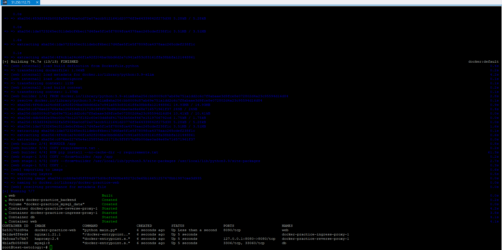

Заходим на сайт проверки **http** подключений и запускаем проверку проверку сервиса:

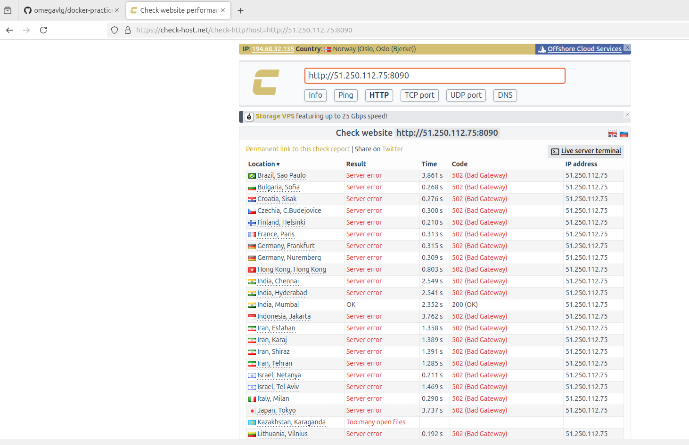

Повторрно выполняем запросы к БД:

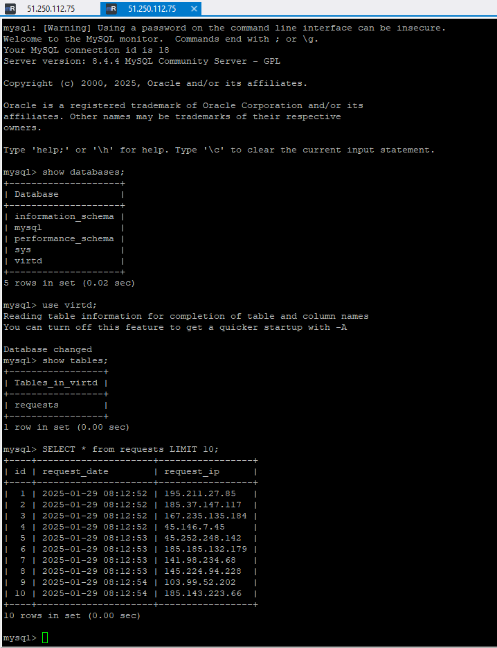

---
## Задача 6
Скачайте docker образ ```hashicorp/terraform:latest``` и скопируйте бинарный файл ```/bin/terraform``` на свою локальную машину, используя dive и docker save.
Предоставьте скриншоты  действий .

### Ответ: 

Скачиваем образ **terraform** командой:

```
docker pull hashicorp/terraform:latest
```
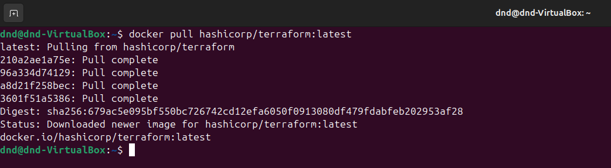

Устанавливаем **dive**
```
wget https://github.com/wagoodman/dive/releases/download/v0.12.0/dive_0.12.0_linux_amd64.tar.gz
```
```
tar -xvzf dive_0.12.0_linux_amd64.tar.gz
```
```
sudo mv dive /usr/local/bin/
```
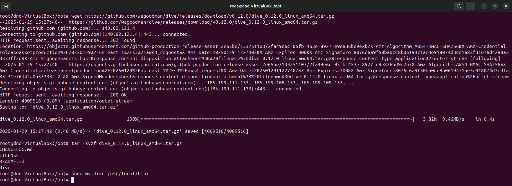

Запускаем **dive** для анализа образа. Опеределяем в каком слое неходится бинарник **terraform** и копируенм идентификатор этого слоя:

```
dive hashicorp/terraform:latest
```
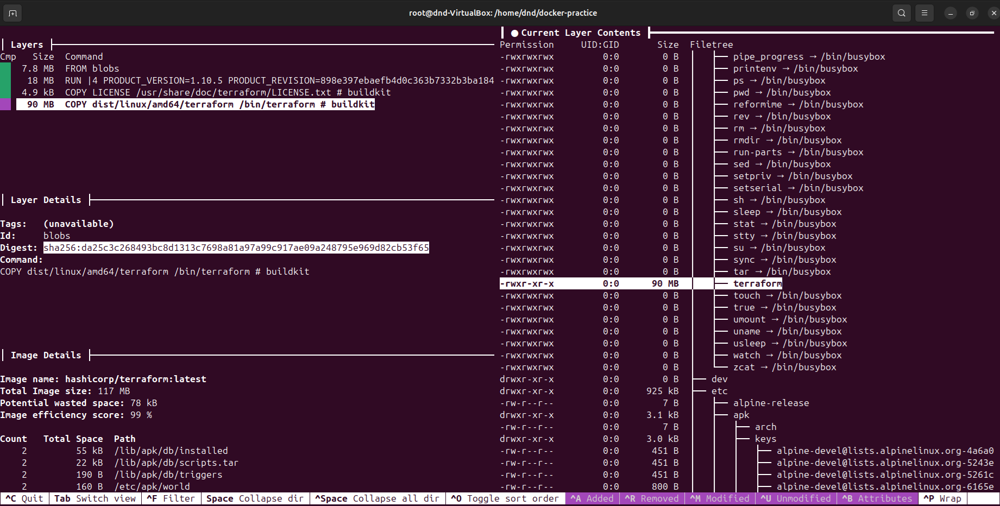

```
da25c3c268493bc8d1313c7698a81a97a99c917ae09a248795e969d82cb53f65
```

После этого сохраняем образ в файловую систему командой:

```
docker save -o terraform.tar hashicorp/terraform:latest
```

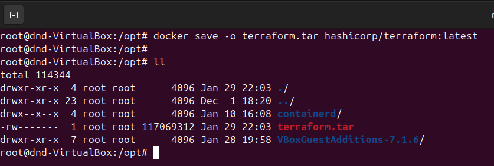

Распаковываем полученный архивв с образом, далее переходим в распакованную директорию **bblobs/sha256**, находим нужный нам слой и так же его распаковываем. Появляетеся еще одна дииректория **bin**. В этой директории находится искомый файл.

```
tar xf terraform.tar
```
```
cd blobs/sha256
```
```
tar xf da25c3c268493bc8d1313c7698a81a97a99c917ae09a248795e969d82cb53f65
```
```
cd bin
```
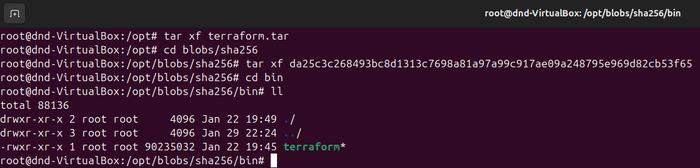

---
## Задача 6.1
Добейтесь аналогичного результата, используя docker cp.  
Предоставьте скриншоты  действий .

### Ответ: 
